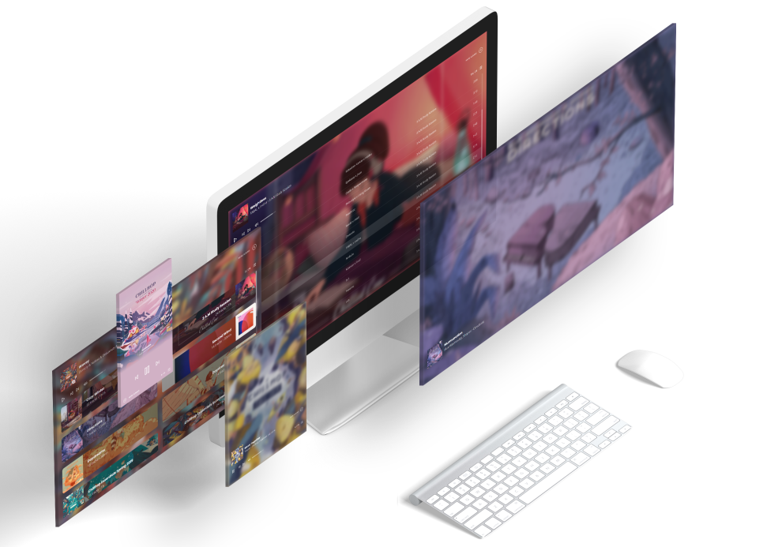

<p align="center">
    
    <br/>
    <br/>
    
    
    
</p>

# Preview
<p align="center">
    
    <br/>
    <br/>
</p>

# Infos

☕ ***Chill*** is a small one week project whose goal was to create an ***instant chill*** music player, grealty inspire from Traf's [Sunday.fm](https://sunday.fm/).

I mainly made this website for me, so all the available albums are chosen among my favorites ones. And *Yes*, I have chosen to stream albums and not 24/7 web radio feed in order to keep a certain consistency among tracks. 

Hope you like it 💖

*(The player is directly streaming from Youtube via a hidden youtube embed player. Nothing is stored on the web server)*

# Live

## 🔗 ***[chill.tina.cafe](http://chill.tina.cafe/)***
Served using *[💨 Yeetify](https://github.com/tinawng/yeetify)*

# Features
- ✨ Clean & minimalist player design
- ➰ Never ending music flow
- 💿 Hand picked album selection
- 📱 Mobile compatible
- 💨 Super lightweight (html+css+js < 100kB)

# Stack

### Nuxt.js
- ⚡️ Static website generation
### Tailwind
- 💄 Responsive design
- 🎨 PurgeCSS

# Next

### Mobile compatibility
- ~~Prevent screen sleep~~
- ~~Dedicated mobile UI design~~

# Links

- 🏗️ Nuxt.js: *[https://nuxtjs.org](https://nuxtjs.org/)*
- ✨ Vue.js: *[https://vuejs.org](https://vuejs.org/)*
- 💄 Tailwind CSS: *[https://tailwindcss.com](https://tailwindcss.com/)*

# Build Process

```bash
# install dependencies
$ yarn install

# dev server with hot reload
$ npm run dev

# build for production
$ npm run generate
```
